 

## 🛠️ Languages & Tools

    

    

 

---

## 📊 GitHub Stats

---

## 👨‍💻 About Me

  

  <b>👤 Name:</b> Jeel Savaliya &nbsp;&nbsp;|&nbsp;&nbsp; <b>💻 Role:</b> Software Developer &nbsp;&nbsp;|&nbsp;&nbsp; <b>📍 Location:</b> Mumbai,India

 

